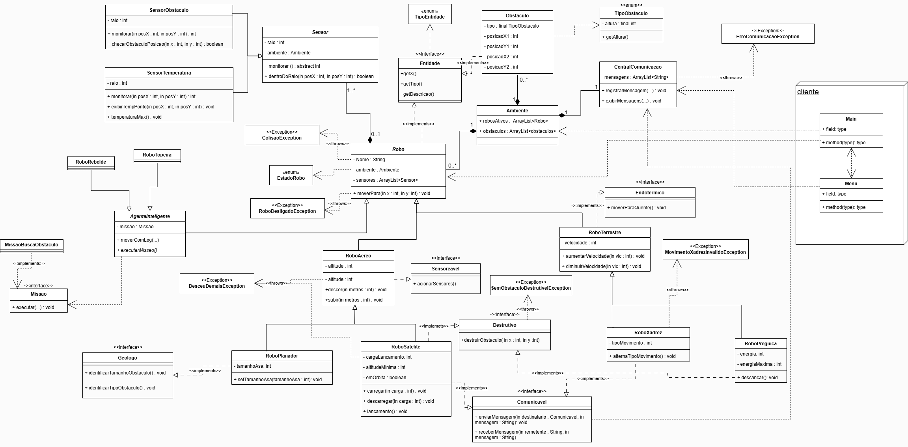

# **MC322**

Esse é o *Repositório Oficial*™ do grupo 8 para os laboratórios de MC322, onde se encontram os arquivos de cada tarefa e esse documento com explicações mais detalhadas sobre as ideias importantes do código. Para especificações dos métodos em si, recomenda-se ler os comentários.  

Informações sobre os outros laboratórios podem ser encontradas na nossa [Wiki](https://github.com/lucasUnicamp/MC322/wiki)!

**Autoria de:**
- 276617 &emsp; Lucas Henrique Bertanha     
- 281289 &emsp; Leonardo Ferreira

## **- EXECUÇÃO**
Dentro da pasta MC322, usar os comandos para compilação e execução do laboratório mais recente: 
- `javac -d bin src/Lab05/cliente/*.java ./src/Lab05/simulador/agentesinteligentes/*.java ./src/Lab05/simulador/ambiente/*.java ./src/Lab05/simulador/enums/*.java ./src/Lab05/simulador/excecoes/*.java ./src/Lab05/simulador/interfaces/*.java ./src/Lab05/simulador/missoes/*.java ./src/Lab05/simulador/robos/*.java ./src/Lab05/simulador/sensores/*.java`
- `java -cp bin cliente.Main`

Caso queira rodar laboratórios passados, basta substituir o número que segue `Lab`

Recomenda-se usar:
- **IDE:** VS Code
- **Versão do Java:** 21.0.6

## **- DIAGRAMA DE CLASSES**

## **- EXPLICAÇÕES**
#### --- AGENTE INTELIGENTE 
Nova classe abstrata que herda de Robô. Pode ter missões atribuídas para serem executadas pelo menu de **Extras** e registradas em um arquivo de texto. Dois desses foram criados:
* *Robo Toupeira*:
    - Não é barrado por obstáculos, mas passa dentro deles;
* *Robo Rebelde*:
    - Tem uma chance de andar mais do que lhe foi pedido;
    - Tem uma chance de não realizar a missão.

#### --- INTERFACES 
* *Missão*
    - Tem o método executar que é usado para realizar de fato a missão;
    - E um método getNome() para nomearmos a missão.

#### --- MISSÕES 
As missões podem ser atribuidas aos Agentes Inteligentes pelo menu de **Extras** desses. Robôs não inteligentes não conseguem ter missões atribuídas. Duas foram criadas:
* *Missão Patrulhar*:
    - O robô anda em um quadrado de lado 10, em que a posição inicial corresponde ao vértice inferior esquerdo;
    - Caso colida com algum obstáculo, avisa tanto para o usuário quanto no log.
* *Missão Buscar Obstáculo*:
    - O robô vai se deslocando aleatoriamente pelo ambiente até que encontre um obstáculo;
    - Registra para o usuário e no log a posição em que o obstáculo foi encontrado.

#### --- MENU INTERATIVO 
O submenu de **Extras** presente nos robôs agora tem as opções de atribuir uma missão ao robô e executar essa missão. Como dito, apenas agentes inteligentes podem ter missões atribuidas e, portanto, realizá-las.
