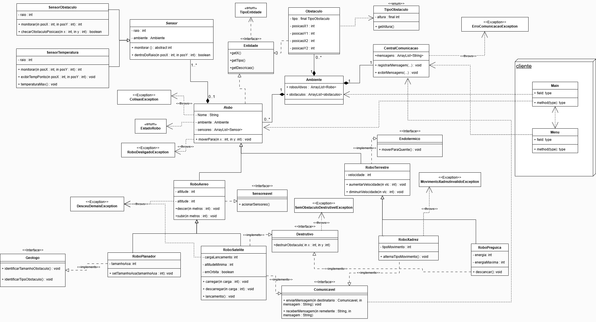

# **MC322**

Esse é o *Repositório Oficial*™ do grupo 8 para os laboratórios de MC322, onde se encontram os arquivos de cada tarefa e esse documento com explicações mais detalhadas sobre as ideias importantes do código. Para especificações dos métodos em si, recomenda-se ler os comentários.  

Informações sobre os outros laboratórios podem ser encontradas na nossa [Wiki](https://github.com/lucasUnicamp/MC322/wiki)!

**Autoria de:**
- 276617 &emsp; Lucas Henrique Bertanha     
- 281289 &emsp; Leonardo Ferreira

## **- EXECUÇÃO**
Dentro da pasta MC322, usar os comandos para compilação e execução do laboratório mais recente: 
- `javac -d bin src/Lab04/cliente/*.java src/Lab04/simulador/*.java .\src\Lab04\simulador\excecoes\*.java .\src\Lab04\simulador\interfaces\*.java`
- `java -cp bin cliente.Main`

Caso queira rodar laboratórios passados, basta substituir o número que segue `Lab`

Recomenda-se usar:
- **IDE:** VS Code
- **Versão do Java:** 21.0.6

## **- DIAGRAMA DE CLASSES**

## **- EXPLICAÇÕES**
#### --- ROBÔ 
Robô agora é uma classe abstrata. Também agora tem um ID e um Estado (ligado/desligado). 

O ID é dado na inicialização, enquanto que o Estado pode ser mudado pelo submenu do robô. Enquanto desligado, o robô tem a maioria de suas ações limitadas (não pode se mover, por exemplo). 

#### --- MENU INTERATIVO 
O Menu Interativo agora está melhor formatado e tem mais informações. 

O Ambiente recebeu um submenu próprio com funções úteis para controle e visualização dos robôs.

Já os robôs continuam com seus próprios submenus que agora também têm um subsubmenu chamado **Extras**, em que se pode realizar as tarefas específicas de cada robô e usar métodos das interfaces novas.

#### --- AMBIENTE 
O Ambiente agora conta com uma matriz 3D de Entidades, que permite armazenar as posições dos robôs e dos obstáculos dinâmicamente. Tem também uma Central de Comunicação, na qual se pode imprimir uma lista com as mensagens trocadas. Isso tudo está em um submenu próprio, que contém as seguintes funções:
* **Visualizar Ambiente**: permite a visualização *top-down 2D* do Ambiente, com símbolos específicos para cada entidade
* **Listar Robôs**: printa as informações úteis de todos robôs do ambiente (char de representação, id, tipo, nome, posição e status)
* **Ligar todos os Robôs**: liga todos os robôs do Ambiente
* **Exibir Mensagens**: printa as mensagens que foram trocadas entre robôs comunicáveis

#### --- INTERFACES 
**----- Pedidas**
* *Entidade*:
    - Tivemos que convencionar o X, Y e Z do obstáculo como a menor coordenada (ponta inferior do objeto) e usar suas dimensões posteriormente para fazer as operações;
    - Implementado por `Robo` e `Obstaculo`.
* *Comunicavel*:
    - Pode enviar mensagens de texto para outros comunicáveis, que vão para a Central de Comunicação. O horário que a mensagem foi enviada também é registrado!
    - Implementado por `RoboSatelite` e `RoboXadrez`.
* *Sensoreavel*:
    - Permite que acione todos os sensores de uma vez e monitore um quadrado em sua volta;
    - Implementado por `RoboAereo`.

**----- Personalizadas**
* *Destrutivo*:
    - Permite que obstáculos sejam destrúidos caso use a ação `Destruir`, presente no submenu **Extras**, em uma posição (que seja um obstáculo) adjacente ao robô. Para robôs Aéreos com essa interface, basta que esteja voando, não necessariamente adjacente ao obstáculo, para destruí-lo;
    - Implementado por `RoboPreguica` e `RoboSatelite`.
* *Endotermico*:
    - Permite que o robô se mova até a posição do Ambiente com a maior temperatura (gradiente de temp. implementado no Lab03). O robô se move para a posição mais quente registrada em seu Sensor de Temperatura, faz uma nova medição, e repete até chegar na posição mais quente global;
    - Implementado por `RoboTerrestre`, `RoboXadrez` e `RoboPreguica`.

#### --- EXCEÇÕES 
**----- Pedidas**
* *RoboDesligado*:
    - Caso o robô tente fazer ações como movimentação ou usar sensores enquanto desligado;
    - Implementado por todos os robôs, lançado em quase todas as ações, `moverPara`, `moverComSensor`, `moverPlanando`, `moverParaQuente`, `usarSensor`, `acionarSensores`, `subir`, `descer`, `carregar`, `descarregar`, `lancamento`, `executarTarefa`,`enviarMensagem` e `receberMensagem`.
* *ErroComunicacao*:
    - Quando um robô com a interface Comunicável tenta enviar uma mensagem para outro robô que não tenha a interface;
    - Implementado por `CentralComunicacao`, lançado em `checarDestinatario`.
* *Colisao*:
    - Quando o robô colide com um obstáculo durante a movimentação;
    - Implementado por `Robo`, lançado em `moverSemSensor`.

**----- Personalizadas**
* *SemObstaculoDestrutivel*:
    - Quando um robô tenta usar a ação `Destruir` em uma posição que não é um obstáculo ;
    - Implementado por `RoboAereo` e `RoboSatelite`, lançado em `destruirObstaculo`.
* *DesceuDemais*:
    - Quando um robô Aéreo desce uma quantidade maior do que a altidude em que está, gera um erro para não chegar a altidudes negativas;
    - Implementado por `RoboAereo`, lançado em `descer`.
* *MovimentoXadrezInvalidoException*:
    - Quando um robô Xadrez tenta se mover sem seguir a movimentação correta da pedra que representa (Peão ou Cavalo);
    - Implementado por `RoboXadrez`, lançado em `mover`.

#### --- TAREFAS 
Cada tipo de robô controlável recebeu uma tarefa específica, que é uma ação temática  acessível pelo submenu **Extras**. Essas são:
* *Marchar em frente*:
    - O robô anda em linha reta na direção em que está 'olhando', parando apenas caso colida com um obstáculo ou saia do ambiente;
    - Implementado por `RoboTerrestre`.
* *Mover como Rainha*:
    - Permite que a próxima movimentação do robô seja feita como a peça Rainha do xadrez; 
    - Implementado por `RoboXadrez`.
* *Superdescansamento*:
    - O robô descansa e carrega suas energias ao máximo;
    - Implementado por `RoboPreguica`.
* *Teleportar*:
    - O robô viaja super rápido e se teletransporta para uma posição aleatória do ambiente;
    - Implementado por `RoboAereo`.
* *Trocar sentido do Planador*:
    - Passa a subir ao invés de descer enquanto se move. Pode ser usado novamente para reverter o sentido;
    - Implementado por `RoboPlanador`.
* *Carga ideal para Órbita*:
    - Calcula o intervalo perfeito de valores de carregamento para colocar o robô em órbita; 
    - Implementado por `RoboSatelite`.

