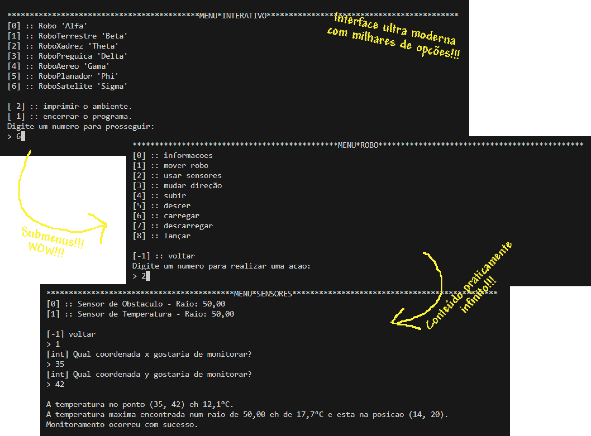

# **MC322**

Esse é o *Repositório Oficial*™ do grupo 8 para os laboratórios de MC322, onde se encontram os arquivos de cada tarefa e esse documento com explicações mais detalhadas sobre as ideias importantes do código.<br/>

**Autoria de:**
- 276617 &emsp; Lucas Henrique Bertanha     
- 281289 &emsp; Leonardo Ferreira

## **- EXECUÇÃO**
Dentro da pasta MC322, usar os comandos para compilação e execução do laboratório mais recente:<br/>
- `javac -d bin src/Lab03/cliente/*.java src/Lab03/simulador/*.java`
- `java -cp bin cliente.Main`

<sup>Caso queira rodar laboratórios passados, basta substituir o número que segue `Lab`</sup>

Recomenda-se usar:
- **IDE:** VS Code
- **Versão do Java:** 21.0.6

## **- EXPLICAÇÕES**
> ### **-- LAB03**
#### --- MOVIMENTAÇÃO DO ROBÔ<br/>
Em razão da implementação de sensores, houve uma pequena mudança na movimentação do Robô Genérico. Agora, dado um `deltaX` e um `deltaY`, o robô irá sempre tentar percorrer todo o `deltaX` primeiro e depois o `deltaY`, parando de se mover:
- caso chegue ao seu destino.
- caso colida com algum obstáculo.
- caso chegue em um dos limites do ambiente.

Nota-se que agora o robô genérico faz os cheques de viabilidade de movimento *durante* essa movimentação. Ademais, o Robô Aéreo e seus filhos não conseguem mais se mover caso não tenham um sensor de obstáculo.

#### --- TIPOS DE ROBÔ<br/>
Novamente em razão dos sensores, um dos robôs foi mudado:
- *Robô Aéreo Satélite*
    - pode ser carregado com uma carga que o permite ser lançado verticalmente. Se tiver carga suficiente, entra em órbita e pode se movimentar como um robô aéreo normalmente nessa região.

Os outros tipos de robôs permanecem inalterados.

#### --- AMBIENTE<br/>
O Ambiente agora conta com um novo atributo, a *Temperatura*, para que possamos monitorá-la com um sensor. Um ponto aleatório é escolhido e lhe é atribuído uma temperatura, também aleatória, a partir da qual todas as posições em seu arredor serão progressivamente menores, seguindo uma [Função Gaussiana](https://en.wikipedia.org/wiki/Gaussian_function#Two-dimensional_Gaussian_function).

#### --- TIPOS DE SENSORES<br/>
Os 2 tipos de sensores que criamos são:
- *Sensor de Obstáculo*
    - consegue checar se determinada posição dentro de seu alcance é um obstáculo ou não.
    - consegue avaliar se há obstáculos impedindo a movimentação do robô até certo ponto antes mesmo dele se movimentar.
- *Sensor de Temperatura*
    - consegue checar a temperatura de um ponto específico dentro de seu alcance.
    - exibe a maior temperatura, junto de suas coordenadas, dentro do alcance.

 Assim, um robô que tenha o sensor de obstáculo testa se há caminhos livres antes de se movimentar, tal como um robô do Lab02, ao invés de mover-se até bater em algo.

 #### --- MENU INTERATIVO<br/>

 
 O Menu Interativo criado é bastante simples, recebendo apenas entradas de valores inteiros[^1] que agem como opções do menu. O programa inicia-se nesse menu, a partir do qual o usuário poderá escolher um dos robôs para controlar digitando seu número específico. Isso exibirá o submenu do robô, que listará as ações específicas desse. Ao escolher uma, basta digitar os parâmetros que serão pedidos para que o robô realize a ação desejada.<br/>

 É possível realizar quantas ações quiser e também voltar ao menu principal para trocar de robô, imprimir o ambiente ou encerrar o programa.

 #### --- DIAGRAMA DE CLASSES<br/>


Seguindo o que foi explicado em aula, o diagrama foi construido com foco em relacionar as classes e apresentar seus principais métodos. Nota-se a relação de herança entre os diferentes tipos de robôs e também a de composição entre o sensor e o robô, uma vez que aquele só existe dentro deste.

---
---
> ### **-- LAB02**
#### --- MOVIMENTAÇÃO DO ROBÔ<br/>
Consideramos que o robô pode tomar somente dois caminhos dado um `deltaX` e um `deltaY`, sendo esses:
- mover-se `deltaX` totalmente no eixo X primeiro e depois `deltaY` totalmente no eixo Y.
```
# # # # []
# # # # []
[][][][][]
```
- mover-se `deltaY` totalmente no eixo Y primeiro e depois `deltaX` totalmente no eixo X.
```
[][][][][]
[] # # # #
[] # # # #
```
<sup>Em que [ ] representa o caminho que o robô irá fazer.</sup>

#### --- TIPOS DE ROBÔ<br/>
Os 4 robôs adicionais que criamos são:
- *Robô Terrestre Xadrex*
    - move-se ou como a peça Cavalo[^2], que anda duas posições em uma direção e uma na outra, formando um L; ou um Peão[^3], que deve andar uma ou duas posições para alguma direção.
- *Robô Terrestre Preguiça*
    - move-se normalmente mas descarrega sua energia a cada movimento, tendo que descançar para reabastecê-la.
- *Robô Aéreo Planador*
    - move-se normalmente na horizontal e vertical, mas sua altitude vai diminuindo conforme é deslocado.
- *Robô Aéreo Satélite*
    - move-se normalmente e consegue escanear uma área circular à procura de obstáculos dado um ângulo de visão; quanto mais alto, mais consegue ver.


[^1]: Embora tenhamos implementado tratamento para entradas inteiras inválidas, não fizemos o mesmo para entradas não-inteiras (como Strings) por ser assunto de aulas futuras.
[^2]: [Cavalo (xadrez)](<https://pt.wikipedia.org/wiki/Cavalo_(xadrez)>)
[^3]: [Peão (xadrez)](<https://pt.wikipedia.org/wiki/Pe%C3%A3o_(xadrez)>)
